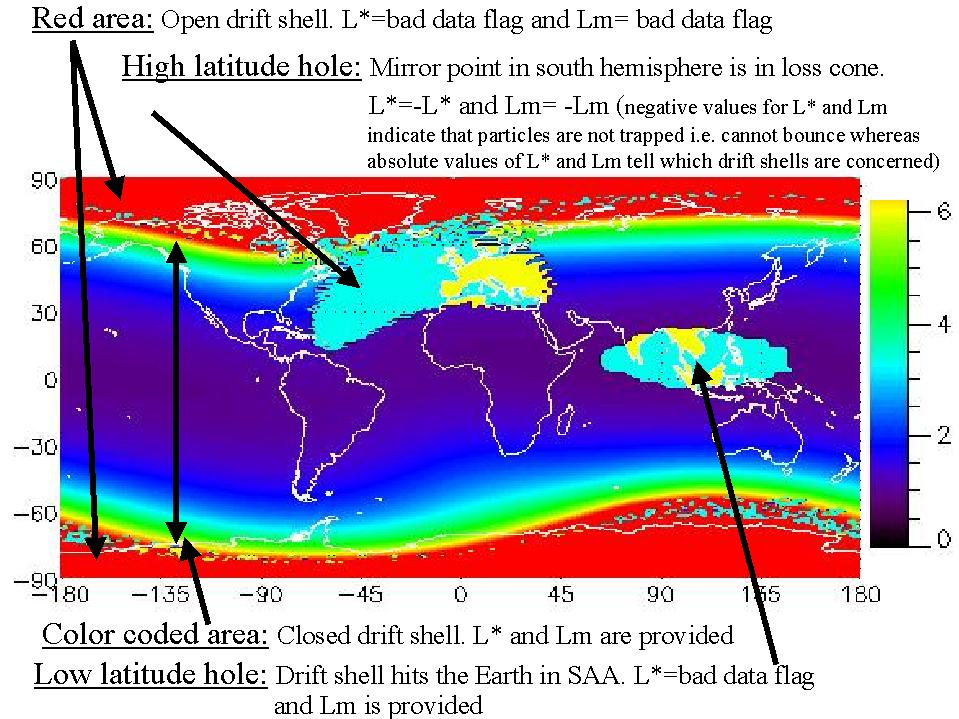

Magnetic coordinates and fields
===============================

Computing magnetic field coordinates
------------------------------------

The following routines compute magnetic coordinates for a given set of positions. The following coordinates are computed:

* McIlwain Lm parameter
* Roederer L* parameter
* Φ coordinate (Φ=2π Bo/L*)
* magnetic field magnitude at the mirror point
* magnetic field magnitude at equator
* second invariant I parameter
* magnetic local time (MLT)

Concerning the Lm and L* parameters, the IRBEM routines outputs also encodes whether local particles are trapped
or not - either because they don't belong to a closed drift shell, or because the drift shell intersects the atmosphere.
The coding of this information is presented in the following figure:

.. _Lstar-coding:

   Coding of the Lm and L* parameters in IRBEM routines

.. irbem:routine:: MAKE_LSTAR

   This function allows one to compute the magnetic coordinates at any spacecraft positions.

   A set of internal/external field can be selected.   

   .. note::
        This routine computes the L* parameter for locally mirroring particles (local picth angle of 90 degrees).
        See :irbem:ref:`MAKE_LSTAR_SHELL_SPLITTING` to compute L* for arbitrary pitch angles.

   .. note::
        For a fast approximation of this function for the Olson-Pfitzer Quiet
        magnetic field model, see the :irbem:ref:`LANDI2LSTAR` routine.

   :param integer ntime: number of time points
   :param integer kext: key for the :ref:`kext`
   :param array of 5 integer options: :ref:`options`
   :param integer sysaxes: key for the input coordinate system (see :ref:`sysaxes`)
   :param array of `ntime` integer iyear: the year
   :param array of `ntime` integer idoy: the day of year (January 1st is `idoy=1`)
   :param array of `ntime` double UT: the time in seconds 
   :param array of `ntime` double x1: first coordinate according to `sysaxes`
   :param array of `ntime` double x2: second coordinate according to `sysaxes`
   :param array of `ntime` double x3: third coordinate according to `sysaxes`
   :param array of [25, `ntime`] double maginput: :ref:`maginput`
   :output array of `ntime` double Lm: L McIlwain - see :ref:`Lstar-coding`
   :output array of `ntime` double Lstar: Roederer L* or Φ=2π Bo/L* (nT Re\ :sup:`2`), depending on the `options` value - for L*, see :ref:`Lstar-coding`
   :output array of `ntime` double Blocal: magnitude of magnetic field at point (nT)
   :output array of `ntime` double Bmin: magnitude of magnetic field at equator (nT)
   :output array of `ntime` double XJ: I, related to second adiabatic invariant (Re)
   :output array of `ntime` double MLT: magnetic local time (h)
   :callseq MATLAB: [Lm,Lstar,Blocal,Bmin,J,MLT] = onera_desp_lib_make_lstar(kext,options,sysaxes,matlabd,x1,x2,x3,maginput)
   :callseq IDL: result = call_external(lib_name, 'make_lstar_', ntime,kext,options,sysaxes,iyear,idoy,ut, x1,x2,x3, maginput, lm,lstar,blocal,bmin,xj,mlt, /f_value)
   :callseq FORTRAN: call make_lstar1(ntime,kext,options,sysaxes,iyear,idoy,ut, x1,x2,x3, maginput, lm,lstar,blocal,bmin,xj,mlt)
   :callseq Python: model = MagFields()
                    LLA = {'x1':651, 'x2':63, 'x3':20, 'dateTime':'2015-02-02T06:12:43'}
                    maginput = {'Kp':40}
                    output_dictionary = model.make_lstar(LLA, maginput)
                    
.. irbem:routine:: MAKE_LSTAR_SHELL_SPLITTING

   This function allows one to compute the magnetic coordinates at any spacecraft position and pitch-angle.

   A set of internal/external field can be selected.   

   :param integer ntime: number of time points
   :param integer npa: number of requested pitch angles, up to :code:`NALPHA_MAX` (see :ref:`NALPHA_MAX`)
   :param integer kext: key for the :ref:`kext`
   :param array of 5 integer options: :ref:`options`
   :param integer sysaxes: key for the input coordinate system (see :ref:`sysaxes`)
   :param array of `ntime` integer iyear: the year
   :param array of `ntime` integer idoy: the day of year (January 1st is `idoy=1`)
   :param array of `ntime` double UT: the time in seconds 
   :param array of `ntime` double x1: first coordinate according to `sysaxes`
   :param array of `ntime` double x2: second coordinate according to `sysaxes`
   :param array of `ntime` double x3: third coordinate according to `sysaxes`
   :param array of `npa` double alpha: local pitch angles (deg)
   :param array of [25, `ntime`] double maginput: :ref:`maginput`
   :output array of [`ntime`, `NALPHA_MAX`] double Lm: L McIlwain - see :ref:`Lstar-coding`
   :output array of [`ntime`, `NALPHA_MAX`] double Lstar: Roederer L* or Φ=2π Bo/L* (nT Re\ :sup:`2`), depending on the `options` value - for L*, see :ref:`Lstar-coding`
   :output array of [`ntime`, `NALPHA_MAX`] double Bmirr: magnitude of magnetic field at mirror point (nT)
   :output array of `ntime` double Bmin: magnitude of magnetic field at equator (nT)
   :output array of [`ntime`, `NALPHA_MAX`] double XJ: I, related to second adiabatic invariant (Re)
   :output array of `ntime` double MLT: magnetic local time (h)
   :callseq MATLAB: [Lm,Lstar,Bmirror,Bmin,J,MLT] = onera_desp_lib_make_lstar_shell_splitting(kext,options,sysaxes,matlabd,x1,x2,x3,alpha,maginput) 
   :callseq IDL: result = call_external(lib_name, 'make_lstar_shell_splitting_', ntime,Npa,kext,options,sysaxes,iyear,idoy,ut, x1,x2,x3,alpha,maginput,lm,lstar,bmirr,bmin,xj,mlt, /f_value)
   :callseq FORTRAN: call make_lstar_shell_splitting1(ntime,Npa,kext,options,sysaxes,iyear,idoy,ut, x1,x2,x3, alpha,maginput,lm,lstar,bmirr,bmin,xj,mlt)
                    
.. irbem:routine:: LANDI2LSTAR

   This function allows one to compute the magnetic coordinates at any spacecraft positions.

   This routine differs from :irbem:ref:`MAKE_LSTAR` because L* is deduced from
   Lm, I and day of year empirically, which is much faster. This is set only
   for IGRF+Olson-Pfitzer quiet field model (:code:`kext` can only be 5). The errors in
   L* values are less than 2%.

   .. note::
        This routine computes the L* parameter for locally mirroring particles (local picth angle of 90 degrees).
        See :irbem:ref:`LANDI2LSTAR_SHELL_SPLITTING` to compute L* for arbitrary pitch angles.

   :param integer ntime: number of time points
   :param integer kext: key for the :ref:`kext`
   :param array of 5 integer options: :ref:`options`
   :param integer sysaxes: key for the input coordinate system (see :ref:`sysaxes`)
   :param array of `ntime` integer iyear: the year
   :param array of `ntime` integer idoy: the day of year (January 1st is `idoy=1`)
   :param array of `ntime` double UT: the time in seconds 
   :param array of `ntime` double x1: first coordinate according to `sysaxes`
   :param array of `ntime` double x2: second coordinate according to `sysaxes`
   :param array of `ntime` double x3: third coordinate according to `sysaxes`
   :param array of [25, `ntime`] double maginput: :ref:`maginput`
   :output array of `ntime` double Lm: L McIlwain - see :ref:`Lstar-coding`
   :output array of `ntime` double Lstar: Roederer L* or Φ=2π Bo/L* (nT Re\ :sup:`2`), depending on the `options` value - for L*, see :ref:`Lstar-coding`
   :output array of `ntime` double Blocal: magnitude of magnetic field at point (nT)
   :output array of `ntime` double Bmin: magnitude of magnetic field at equator (nT)
   :output array of `ntime` double XJ: I, related to second adiabatic invariant (Re)
   :output array of `ntime` double MLT: magnetic local time (h)
   :callseq MATLAB: [Lm,Lstar,Blocal,Bmin,J,MLT] = onera_desp_lib_landi2lstar(kext,options,sysaxes,matlabd,x1,x2,x3,maginput) 
   :callseq IDL: result = call_external(lib_name, 'landi2lstar_', ntime,kext,options,sysaxes,iyear,idoy,ut, x1,x2,x3, maginput, lm,lstar,blocal,bmin,xj,mlt, /f_value)
   :callseq FORTRAN: call landi2lstar1(ntime,kext,options,sysaxes,iyear,idoy,ut, x1,x2,x3, maginput, lm,lstar,blocal,bmin,xj,mlt)

.. irbem:routine:: LANDI2LSTAR_SHELL_SPLITTING

   This function allows one to compute the magnetic coordinates at any spacecraft position and pitch-angle.

   This routine differs from :irbem:ref:`MAKE_LSTAR_SHELL_SPLITTING` because L* is deduced from
   Lm, I and day of year empirically, which is much faster. This is set only
   for IGRF+Olson-Pfitzer quiet field model (:code:`kext` can only be 5). The errors in
   L* values are less than 2%.

   :param integer ntime: number of time points
   :param integer npa: number of requested pitch angles, up to :code:`NALPHA_MAX` (see :ref:`NALPHA_MAX`)
   :param integer kext: key for the :ref:`kext`
   :param array of 5 integer options: :ref:`options`
   :param integer sysaxes: key for the input coordinate system (see :ref:`sysaxes`)
   :param array of `ntime` integer iyear: the year
   :param array of `ntime` integer idoy: the day of year (January 1st is `idoy=1`)
   :param array of `ntime` double UT: the time in seconds 
   :param array of `ntime` double x1: first coordinate according to `sysaxes`
   :param array of `ntime` double x2: second coordinate according to `sysaxes`
   :param array of `ntime` double x3: third coordinate according to `sysaxes`
   :param array of `npa` double alpha: local pitch angles (deg)
   :param array of [25, `ntime`] double maginput: :ref:`maginput`
   :output array of [`ntime`, `NALPHA_MAX`] double Lm: L McIlwain - see :ref:`Lstar-coding`
   :output array of [`ntime`, `NALPHA_MAX`] double Lstar: Roederer L* or Φ=2π Bo/L* (nT Re\ :sup:`2`), depending on the `options` value - for L*, see :ref:`Lstar-coding`
   :output array of [`ntime`, `NALPHA_MAX`] double Bmirr: magnitude of magnetic field at mirror point (nT)
   :output array of `ntime` double Bmin: magnitude of magnetic field at equator (nT)
   :output array of [`ntime`, `NALPHA_MAX`] double XJ: I, related to second adiabatic invariant (Re)
   :output array of `ntime` double MLT: magnetic local time (h)
   :callseq MATLAB: [Lm,Lstar,Bmirror,Bmin,J,MLT] = onera_desp_lib_landi2lstar_shell_splitting(kext,options,sysaxes,matlabd,x1,x2,x3,alpha,maginput) 
   :callseq IDL: result = call_external(lib_name, 'landi2lstar_shell_splitting_', ntime,Npa,kext,options,sysaxes,iyear,idoy,ut, x1,x2,x3,alpha,maginput,lm,lstar,blocal,bmin,xj,mlt, /f_value)
   :callseq FORTRAN: call landi2lstar_shell_splitting1(ntime,Npa,kext,options,sysaxes,iyear,idoy,ut, x1,x2,x3, alpha,maginput,lm,lstar,blocal,bmin,xj,mlt)

.. irbem:routine:: EMPIRICALLSTAR

    This function allows one to compute L* empirically being given Lm, I and
    day of year. This is set only for IGRF+Olson-Pfitzer quiet field model
    (:code:`kext` can only be 5) so Lm and I provided as input must be computed with
    this field. The errors in L* values are less than 2%.

   :param integer ntime: number of time points
   :param integer kext: key for the :ref:`kext`
   :param array of 5 integer options: :ref:`options`
   :param array of `ntime` integer iyear: the year
   :param array of `ntime` integer idoy: the day of year (January 1st is `idoy=1`)
   :param array of [25, `ntime`] double maginput: :ref:`maginput`
   :param array of `ntime` double Lm: L McIlwain
   :param array of `ntime` double XJ: I, related to second adiabatic invariant (Re)
   :output array of `ntime` double Lstar: L Roederer or Φ=2π Bo/L* (nT Re\ :sup:`2`), depending on the `options` value
   :callseq MATLAB: Lstar = onera_desp_lib_empiricallstar(kext,options,matlabd,maginput,Lm,J) 
   :callseq IDL: result = call_external(lib_name, 'empiricalLstar_', ntime,kext,options,iyearsat,idoy, maginput, lm,xj,lstar, /f_value)
   :callseq FORTRAN: call EmpiricalLstar1(ntime,kext,options,iyearsat,idoy,maginput, lm,xj,lstar)

.. irbem:routine:: GET_MLT
   
   Routine to get Magnetic Local Time (MLT) from a :ref:`GEO <GEO>` position and date.

   :param integer iyear: the year
   :param integer idoy: the day of year (January 1st is `idoy=1`)
   :param double secs: the time in seconds 
   :param array of 3 double xGEO: cartesian position in :ref:`GEO <GEO>`
   :output double MLT: Magnetic Local Time (h)
   :callseq MATLAB: MLT = onera_desp_lib_get_mlt(matlabd,xGEO)
   :callseq IDL: result = call_external(lib_name, 'get_mlt_', iyr,idoy,secs,xGEO,MLT, /f_value)
   :callseq FORTRAN: call get_mlt1(iyr,idoy,secs,xGEO,MLT)

.. irbem:routine:: GET_HEMI_MULTI

   This function computes in which magnetic hemisphere is the input location. 

   :param integer ntime: number of time points
   :param integer kext: key for the :ref:`kext`
   :param array of 5 integer options: :ref:`options`
   :param integer sysaxes: key for the input coordinate system (see :ref:`sysaxes`)
   :param array of `ntime` integer iyear: the year
   :param array of `ntime` integer idoy: the day of year (January 1st is `idoy=1`)
   :param array of `ntime` double UT: the time in seconds 
   :param array of `ntime` double x1: first coordinate according to `sysaxes`
   :param array of `ntime` double x2: second coordinate according to `sysaxes`
   :param array of `ntime` double x3: third coordinate according to `sysaxes`
   :param array of [25, `ntime`] double maginput: :ref:`maginput`
   :output array of `ntime` integer xHEMI: +1 for Northern magnetic hemisphere, -1 for Southern magnetic hemisphere, 0 for invalid magnetic field
   :callseq MATLAB: [xHEMI] = onera_desp_lib_get_hemi(kext,options,sysaxes,matlabd,x1,x2,x3,maginput)
   :callseq IDL: result = call_external(lib_name, 'get_hemi_multi_idl_',ntime,kext,options,sysaxes,iyear,idoy,ut, x1,x2,x3, maginput,xHEMI,  /f_value)
   :callseq FORTRAN: call GET_HEMI_MULTI(ntime,kext,options,sysaxes,iyear,idoy,ut, x1,x2,x3, maginput,xHEMI)

.. irbem:routine:: LSTAR_PHI

   Converts from L* to Φ or vice versa.

       Φ=2π*Bo/L*

   :param integer ntime: number of time points
   :param integer whichinv: direction of the transformation: 1 for L* to Φ, 2 for Φ to L*
   :param array of 5 integer options: :ref:`options`
   :param array of `ntime` integer iyear: the year
   :param array of `ntime` integer idoy: the day of year (January 1st is `idoy=1`)
   :output array of `ntime` double Lstar: L* (input or output depending on `whichinv` value)
   :output array of `ntime` double Phi: Φ (nT Re\ :sup:`2`,input or output depending on `whichinv` value)
   :callseq MATLAB: out = onera_desp_lib_lstar_phi(which,options,matlabd,in)
   :callseq IDL: result = call_external(lib_name, lstar_phi_', ntime,whichinv,options,iyear,idoy,lstar,phi, /f_value)
   :callseq FORTRAN: call lstar_phi1(ntime,whichinv,options,iyear,idoy,lstar,phi)

Points of interest on the field line
------------------------------------

.. irbem:routine:: FIND_MIRROR_POINT

   This function finds the magnitude and location of the mirror point along
   a field line traced from any given location and local pitch-angle for a set of internal/external field to be selected. 

   :param integer kext: key for the :ref:`kext`
   :param array of 5 integer options: :ref:`options`
   :param integer sysaxes: key for the input coordinate system (see :ref:`sysaxes`) 
   :param integer iyear: the year
   :param integer idoy: the day of year (January 1st is `idoy=1`)
   :param double UT: the time in seconds 
   :param double x1: first coordinate according to `sysaxes`
   :param double x2: second coordinate according to `sysaxes`
   :param double x3: third coordinate according to `sysaxes`
   :param double alpha: local pitch-angle (deg)
   :param array of 25 double maginput: :ref:`maginput`
   :output double Blocal: magnitude of magnetic field at point (nT)
   :output double Bmirr: magnitude of the magnetic field at the mirror point (nT)
   :output array of 3 double POSIT: :ref:`GEO <GEO>` coordinates of the mirror point (Re)
   :callseq MATLAB: [Blocal,Bmirror,xGEO] = onera_desp_lib_find_mirror_point(kext,options,sysaxes,matlabd,x1,x2,x3,alpha,maginput) 
   :callseq IDL: result = call_external(lib_name,  'find_mirror_point_', kext,options,sysaxes,iyear,idoy,ut, x1,x2,x3,alpha,maginput, blocal,bmir,posit, /f_value)
   :callseq FORTRAN: call find_mirror_point1(kext,options,sysaxes,iyear,idoy,ut, x1,x2,x3,alpha, maginput,blocal,bmir,posit)
   :callseq Python: model = MagFields()
                    LLA = {'x1':651, 'x2':63, 'x3':20, 'dateTime':'2015-02-02T06:12:43'}
                    maginput = {'Kp':40}
                    alpha = 90
                    output_dictionary = model.find_mirror_point(LLA, maginput, alpha) 

.. irbem:routine:: FIND_MAGEQUATOR

   This function finds the GEO coordinates of the magnetic equator along the field line 
   starting from input location for a set of internal/external field to be selected. 

   :param integer kext: key for the :ref:`kext`
   :param array of 5 integer options: :ref:`options`
   :param integer sysaxes: key for the input coordinate system (see :ref:`sysaxes`) 
   :param integer iyear: the year
   :param integer idoy: the day of year (January 1st is `idoy=1`)
   :param double UT: the time in seconds 
   :param double x1: first coordinate according to `sysaxes`
   :param double x2: second coordinate according to `sysaxes`
   :param double x3: third coordinate according to `sysaxes`
   :param array of 25 double maginput: :ref:`maginput`
   :output double Bmin: magnitude of magnetic field at equator (nT)
   :output array of 3 double POSIT: :ref:`GEO <GEO>` coordinates of the magnetic equator (Re)
   :callseq MATLAB: [Bmin,xGEO] = onera_desp_lib_find_magequator(kext,options,sysaxes,matlabd,x1,x2,x3,maginput) 
   :callseq IDL: result = call_external(lib_name, 'find_magequator_',  kext,options,sysaxes,iyear,idoy,ut,  x1,x2,x3, maginput, bmin,posit,  /f_value)
   :callseq FORTRAN: call find_magequator1(kext,options,sysaxes,iyear,idoy,ut,  x1,x2,x3, maginput,bmin,posit)
   :callseq Python: model = MagFields()
                    LLA = {'x1':651, 'x2':63, 'x3':20, 'dateTime':'2015-02-02T06:12:43'}
                    maginput = {'Kp':40}
                    alpha = 90
                    output_dictionary = model.find_magequator(LLA, maginput) 

.. irbem:routine:: FIND_FOOT_POINT

   This function finds the of the field line crossing a specified altitude in a specified hemisphere
   for a set of internal/external field to be selected. 

   :param integer kext: key for the :ref:`kext`
   :param array of 5 integer options: :ref:`options`
   :param integer sysaxes: key for the input coordinate system (see :ref:`sysaxes`) 
   :param integer iyear: the year
   :param integer idoy: the day of year (January 1st is `idoy=1`)
   :param double UT: the time in seconds 
   :param double x1: first coordinate according to `sysaxes`
   :param double x2: second coordinate according to `sysaxes`
   :param double x3: third coordinate according to `sysaxes`
   :param double stop_alt: desired altitude of field-line crossing (km)
   :param integer hemi_flag: key to select the magnetic hemisphere:
      * 0 - Same magnetic hemisphere as starting point
      * +1 - northern magnetic hemisphere
      * -1 - southern magnetic hemisphere
      * +2 - opposite magnetic hemisphere from starting point
   :param array of 25 double maginput: :ref:`maginput`
   :output array of 3 double XFOOT: :ref:`GDZ <GDZ>` coordinates of the foot point (Re)
   :output array of 3 double BFOOT: magnetic field vector (:ref:`GEO <GEO>`) at the foot point (nT)
   :output double BFOOTMAG: magnitude of the magnetic field at the foot point (nT)
   :callseq MATLAB: [Xfoot,Bfoot,BfootMag] = onera_desp_lib_find_foot_point(kext,options,sysaxes,matlabd,x1,x2,x3,stop_alt,hemi_flag,maginput)
   :callseq IDL: result = call_external(lib_name,  'find_foot_point_', kext,options,sysaxes,iyear,idoy,ut, x1,x2,x3,stop_alt,hemi_flag,maginput, xfoot,bfoot,bfootmag, /f_value)
   :callseq FORTRAN: call find_foot_point1(kext,options,sysaxes,iyearsat,idoy,UT,xIN1,xIN2,xIN3,stop_alt,hemi_flag,maginput,XFOOT,BFOOT,BFOOTMAG)
   :callseq Python: model = MagFields()
                    LLA = {'x1':651, 'x2':63, 'x3':20, 'dateTime':'2015-02-02T06:12:43'}
                    maginput = {'Kp':40}
                    stopAlt = 100
                    hemiFlag = 0
                    output_dictionary = model.find_foot_point(LLA, maginput, stopAlt, hemiFlag) 

Magnetic field computation
--------------------------

.. irbem:routine:: GET_FIELD_MULTI
   
   This function computes the magnetic field vector (expressed in the :ref:`GEO <GEO>`
   coordinate system) at the input locations using the selected
   internal and external magnetic field models.

   :param integer ntime: number of time points
   :param integer kext: key for the :ref:`kext`
   :param array of 5 integer options: :ref:`options`
   :param integer sysaxes: key for the input coordinate system (see :ref:`sysaxes`)
   :param array of `ntime` integer iyear: the year
   :param array of `ntime` integer idoy: the day of year (January 1st is `idoy=1`)
   :param array of `ntime` double UT: the time in seconds 
   :param array of `ntime` double x1: first coordinate according to `sysaxes`
   :param array of `ntime` double x2: second coordinate according to `sysaxes`
   :param array of `ntime` double x3: third coordinate according to `sysaxes`
   :param array of [25, `ntime`] double maginput: :ref:`maginput`
   :output array of [3, `ntime`] double Bgeo: `BxGEO`, `ByGEO`, `BzGEO` of the magnetic field (nT)
   :output array of `ntime` double Bl: magnitude of the magnetic field (nT)
   :callseq MATLAB: [Bgeo,B] = onera_desp_lib_get_field(kext,options,sysaxes,matlabd,x1,x2,x3,maginput)
   :callseq IDL: result = call_external(lib_name, 'get_field_multi_idl_',ntime,kext,options,sysaxes,iyear,idoy,ut, x1,x2,x3, maginput,Bgeo, Bl,  /f_value)
   :callseq FORTRAN: call GET_FIELD_MULTI(ntime,kext,options,sysaxes,iyear,idoy,ut, x1,x2,x3, maginput,Bgeo,Bl)
   :callseq Python: model = MagFields()
                    LLA = {'x1':651, 'x2':63, 'x3':20, 'dateTime':'2015-02-02T06:12:43'}
                    maginput = {'Kp':40}
                    output_dictionary = model.get_field_multi(LLA, maginput)

.. irbem:routine:: GET_BDERIVS
   
   This function computes the magnetic field and its 1st-order derivatives at
   each input location for a set of internal/external magnetic field to be
   selected. 

   :param integer ntime: number of time points up to :code:`NTIME_MAX` (see :ref:`NTIME_MAX`)
   :param integer kext: key for the :ref:`kext`
   :param array of 5 integer options: :ref:`options`
   :param integer sysaxes: key for the input coordinate system (see :ref:`sysaxes`)
   :param double dX: step size for the numerical derivatives (Re)
   :param array of `ntime` integer iyear: the year
   :param array of `ntime` integer idoy: the day of year (January 1st is `idoy=1`)
   :param array of `ntime` double UT: the time in seconds 
   :param array of `ntime` double x1: first coordinate according to `sysaxes`
   :param array of `ntime` double x2: second coordinate according to `sysaxes`
   :param array of `ntime` double x3: third coordinate according to `sysaxes`
   :param array of [25, `ntime`] double maginput: :ref:`maginput`
   :output array of [3, `ntime`] double Bgeo: `BxGEO`, `ByGEO`, `BzGEO` of the magnetic field (nT)
   :output array of `ntime` double Bmag: magnitude of the magnetic field (nT)
   :output array of [3, `ntime`] double gradBmag: gradients of `Bmag` in :ref:`GEO <GEO>` (nT)
   :output array of [3, 3, `ntime`] double diffB: derivatives of the magnetic field vector (nT) for the n\ :sup:`th` point, `diffB(i,j,n)` = dB\ :sub:`i` / dx\ :sub:`j`
   :callseq MATLAB: [Bgeo,B,gradBmag,diffB] = onera_desp_lib_get_bderivs(kext,options,sysaxes,matlabd,x1,x2,x3,maginput)
   :callseq IDL: result = call_external(lib_name, 'get_bderivs_idl',ntime,kext,options,sysaxes,dX,iyear,idoy,ut, x1,x2,x3, maginput,Bgeo,Bmag,gradBmag,diffB,  /f_value)
   :callseq FORTRAN: call GET_BDERIVS(ntime,kext,options,sysaxes,dX,iyear,idoy,ut, x1,x2,x3, maginput,Bgeo,Bmag,gradBmag,diffB)

.. irbem:routine:: COMPUTE_GRAD_CURV_CURL

   This function computes gradient and curvature force factors and div/curl of
   B from the outputs of :irbem:ref:`GET_BDERIVS`.

   :param integer ntime: number of time points
   :param array of [3, `ntime`] double Bgeo: `BxGEO`, `ByGEO`, `BzGEO` of the magnetic field (nT)
   :param array of `ntime` double Bmag: magnitude of the magnetic field (nT)
   :param array of [3, `ntime`] double gradBmag: gradients of `Bmag` in :ref:`GEO <GEO>` (nT)
   :param array of [3, 3, `ntime`] double diffB: derivatives of the magnetic field vector (nT)
   :output array of `ntime` double grad_par: gradient of Bmag along Bgeo (nT/Re)
   :output array of [3, `ntime`] double grad_perp: gradient of Bmag perpendicular to B (nT/Re)
   :output array of [3, `ntime`] double grad_drift: (Bhat x grad_perp)/Bmag, with Bhat=Bgeo/Bmag part of gradient drift velocity  (1/Re)
   :output array of [3, `ntime`] double curvature:  (Bhat . grad)Bhat, part of curvature force, (1/Re)
   :output array of `ntime` double Rcurv: 1/\|curvature\|, radius of curvature (Re)
   :output array of [3, `ntime`] double curv_drift: Bhat x curvature, part of curvature drift (1/Re)
   :output array of [3, `ntime`] double curlB: curl of B, part of electrostatic current term (nT/Re)
   :output array of `ntime` double divB: divergence of B, should be zero (nT/Re)
   :callseq MATLAB: [grad_par,grad_perp,grad_drift,curvature,Rcurv,curv_drift,curlB,divB] = onera_desp_lib_compute_grad_curv_curl(Bgeo,B,gradBmag,diffB)
   :callseq IDL: result = call_external(lib_name, 'compute_grad_curv_idl',ntime,Bgeo,Bmag,gradBmag,diffB, grad_par,grad_perp,grad_drift,curvature,Rcurv,curv_drift,curlB,divB,   /f_value)
   :callseq FORTRAN: call COMPUTE_GRAD_CURV_CURL(ntime,Bgeo,Bmag,gradBmag,diffB, grad_par,grad_perp,grad_drift,curvature,Rcurv,curv_drift,curlB,divB)

Field tracing
-------------

.. irbem:routine:: TRACE_FIELD_LINE

   This function traces a full field line which crosses the input position. The
   output is a full array of positions of the field line.

   :param integer kext: key for the :ref:`kext`
   :param array of 5 integer options: :ref:`options`
   :param integer sysaxes: key for the input coordinate system (see :ref:`sysaxes`)
   :param integer iyear: the year
   :param integer idoy: the day of year (January 1st is `idoy=1`)
   :param double UT: the time in seconds 
   :param double x1: first coordinate according to `sysaxes`
   :param double x2: second coordinate according to `sysaxes`
   :param double x3: third coordinate according to `sysaxes`
   :param array of 25 double maginput: :ref:`maginput`
   :param double R0: radius of the reference surface between which field line is traced (Re)
   :output double Lm: L McIlwain
   :output array of 3000 double Blocal: magnitude of magnetic field at point (nT)
   :output double Bmin: magnitude of magnetic field at equator (nT)
   :output double XJ: I, related to second adiabatic invariant (Re)
   :output array of (3, 3000) double posit: Cartesian coordinates in :ref:`GEO <GEO>` along the field line
   :output integer Nposit: number of points in `posit`
   :callseq MATLAB: [Lm,Blocal,Bmin,J,POSIT] = onera_desp_lib_trace_field_line(kext,options,sysaxes,matlabd,x1,x2,x3,maginput,R0)
   :callseq IDL: result = call_external(lib_name, 'trace_field_line2_',  kext,options,sysaxes,iyear,idoy,ut, x1,x2,x3,maginput,R0,lm,blocal,bmin,xj,posit,Nposit, /f_value)
   :callseq FORTRAN: call trace_field_line2_1(kext,options,sysaxes,iyear,idoy,ut, x1,x2,x3, maginput,R0, lm,blocal,bmin,xj,posit,Nposit)
   :callseq Python: model = MagFields()
                    LLA = {'x1':651, 'x2':63, 'x3':20, 'dateTime':'2015-02-02T06:12:43'}
                    maginput = {'Kp':40}
                    output_dictionary = model.trace_field_line(LLA, maginput)

.. irbem:routine:: TRACE_FIELD_LINE_TOWARD_EARTH

   This function traces a field line from the input position to the Earth
   surface.  The output is a full array of positions of the field line, usefull
   for plotting and visualisation.

   :param integer kext: key for the :ref:`kext`
   :param array of 5 integer options: :ref:`options`
   :param integer sysaxes: key for the input coordinate system (see :ref:`sysaxes`)
   :param integer iyear: the year
   :param integer idoy: the day of year (January 1st is `idoy=1`)
   :param double UT: the time in seconds 
   :param double x1: first coordinate according to `sysaxes`
   :param double x2: second coordinate according to `sysaxes`
   :param double x3: third coordinate according to `sysaxes`
   :param array of 25 double maginput: :ref:`maginput`
   :param double ds: integration step along the field line (Re)
   :output array of (3, 3000) double posit: Cartesian coordinates in :ref:`GEO <GEO>` along the field line
   :output integer Nposit: number of points in `posit`
   :callseq MATLAB: POSIT = onera_desp_lib_trace_field_line_towards_earth(kext,options,sysaxes,matlabd,x1,x2,x3,maginput,ds)
   :callseq IDL: result = call_external(lib_name, 'trace_field_line_towards_earth_',  kext,options,sysaxes,iyear,idoy,ut,  x1,x2,x3, maginput, ds,posit,Nposit,  /f_value)
   :callseq FORTRAN: call trace_field_line_towards_earth1(kext,options,sysaxes,iyear,idoy,ut, x1,x2,x3, maginput, ds,posit,Nposit)

.. irbem:routine:: DRIFT_BOUNCE_ORBIT

   This function traces a full drift shell for particles that have their
   mirror point at the input location.  The output is a full array of
   positions of the drift shell, usefull for plotting and visualisation.
    
   Key differences from :irbem:ref:`DRIFT_SHELL` : 
    
   * only positions between mirror points are returned
   * 25 - rather than 48 - azimuths are returned
   * Lstar accuracy respects :code:`options(3)` and :code:`options(4)` (see :ref:`options`)
   * a new parameter :code:`R0` is required which specifies the minimum radial
     distance allowed along the drift path (usually `R0` = 1, but use `R0` < 1 in the
     drift loss cone)
   * :code:`hmin` and :code:`hmin_lon` outputs provide the altitude and
     longitude (in :ref:`GDZ <GDZ>`) of the minimum altitude point along the drift
     shell (among those traced, not just those returned).

   :param integer kext: key for the :ref:`kext`
   :param array of 5 integer options: :ref:`options`
   :param integer sysaxes: key for the input coordinate system (see :ref:`sysaxes`)
   :param integer iyear: the year
   :param integer idoy: the day of year (January 1st is `idoy=1`)
   :param double UT: the time in seconds 
   :param double x1: first coordinate according to `sysaxes`
   :param double x2: second coordinate according to `sysaxes`
   :param double x3: third coordinate according to `sysaxes`
   :param double alpha: pitch angle at input location (deg)
   :param array of 25 double maginput: :ref:`maginput`
   :param double R0: radius of the minimum allowed radial distance along the drift orbit (Re)
   :output double Lm: L McIlwain
   :output double Lstar: L Roederer or Φ=2π Bo/L* (nT Re\ :sup:`2`), depending on the `options` value
   :output array of (1000, 25) double Blocal: magnitude of magnetic field at point (nT)
   :output double Bmin: magnitude of magnetic field at equator (nT)
   :output double XJ: I, related to second adiabatic invariant (Re)
   :output array of (3, 1000, 25) double posit: Cartesian coordinates in :ref:`GEO <GEO>` along the drift shell
   :output array of 25 integer Nposit: number of points in `posit` along each traced field line
   :callseq MATLAB: [Lm,Lstar,Blocal,Bmin,Bmir,J,POSIT,hmin,hmin_lon] = onera_desp_lib_drift_bounce_orbit(kext,options,sysaxes,matlabd,x1,x2,x3,alpha,maginput,R0)
   :callseq IDL: result = call_external(lib_name, 'drift_bounce_orbit2_',  kext,options,sysaxes,iyear,idoy,ut,  x1,x2,x3,alpha, maginput,R0, lm,lstar,blocal,bmin,bmir,xj,posit,Nposit,hmin,hmin_lon,  /f_value)
   :callseq FORTRAN: call drift_bounce_orbit2_1(kext,options,sysaxes,iyear,idoy,ut, x1,x2,x3,alpha, maginput,R0 lm,lstar,blocal,bmin,bmir,xj,posit,Nposit,hmin,hmin_lon)
   :callseq Python: model = MagFields()
                    LLA = {'x1':651, 'x2':63, 'x3':20, 'dateTime':'2015-02-02T06:12:43'}
                    maginput = {'Kp':40}
                    output_dictionary = model.drift_bounce_orbit(LLA, maginput)

.. irbem:routine:: DRIFT_SHELL

   This function traces a full drift shell for particles that have their
   mirror point at the input location.  The output is a full array of
   positions of the drift shell, usefull for plotting and visualisation.
    
   .. note::

       To only get the points on the drift-bounce orbit, use :irbem:ref:`DRIFT_BOUNCE_ORBIT`.

   :param integer kext: key for the :ref:`kext`
   :param array of 5 integer options: :ref:`options`
   :param integer sysaxes: key for the input coordinate system (see :ref:`sysaxes`)
   :param integer iyear: the year
   :param integer idoy: the day of year (January 1st is `idoy=1`)
   :param double UT: the time in seconds 
   :param double x1: first coordinate according to `sysaxes`
   :param double x2: second coordinate according to `sysaxes`
   :param double x3: third coordinate according to `sysaxes`
   :param array of 25 double maginput: :ref:`maginput`
   :output double Lm: L McIlwain
   :output double Lstar: L Roederer or Φ=2π Bo/L* (nT Re\ :sup:`2`), depending on the `options` value
   :output array of (1000, 48) double Blocal: magnitude of magnetic field at point (nT)
   :output double Bmin: magnitude of magnetic field at equator (nT)
   :output double XJ: I, related to second adiabatic invariant (Re)
   :output array of (3, 1000, 48) double posit: Cartesian coordinates in :ref:`GEO <GEO>` along the drift shell
   :output array of 48 integer Nposit: number of points in `posit` along each traced field line
   :callseq MATLAB: [Lm,Lstar,Blocal,Bmin,J,POSIT] = onera_desp_lib_drift_shell(kext,options,sysaxes,matlabd,x1,x2,x3,maginput)
   :callseq IDL: result = call_external(lib_name, 'drift_shell_',  kext,options,sysaxes,iyear,idoy,ut,  x1,x2,x3, maginput, lm,lstar,blocal,bmin,xj,posit,Nposit,  /f_value)
   :callseq FORTRAN: call drift_shell1(kext,options,sysaxes,iyear,idoy,ut, x1,x2,x3, maginput, lm,lstar,blocal,bmin,xj,posit,Nposit)
   :callseq Python: model = MagFields()
                    LLA = {'x1':651, 'x2':63, 'x3':20, 'dateTime':'2015-02-02T06:12:43'}
                    maginput = {'Kp':40}
                    output_dictionary = model.drift_shell(LLA, maginput)

